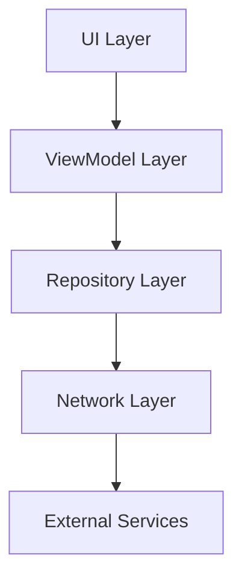
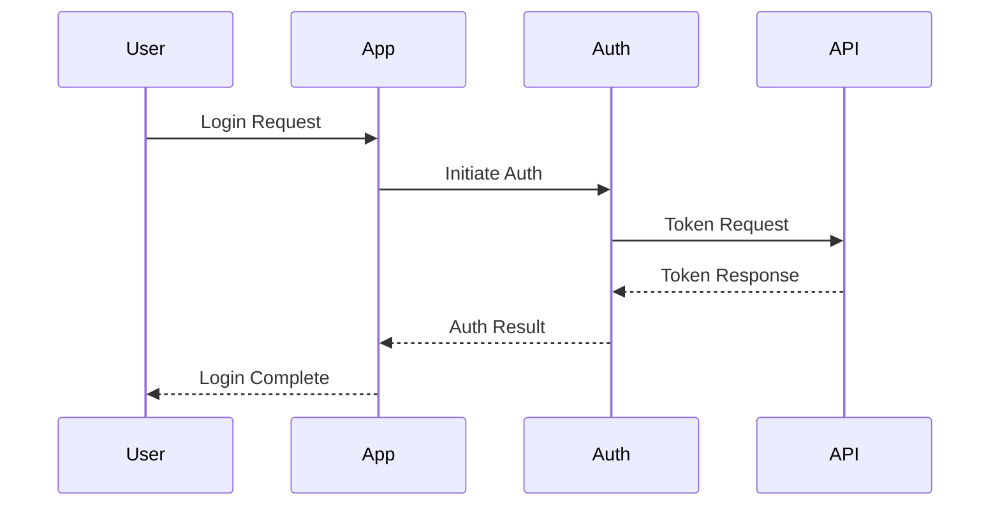
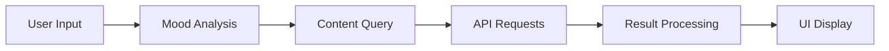

# Cheerly Technical Documentation
Version 1.0  
Last Updated: December 8, 2024

## API Documentation

### 1. Authentication APIs

#### 1.1 Spotify Authentication
```kotlin
interface SpotifyAuthService {
    @POST("api/token")
    @FormUrlEncoded
    suspend fun getAccessToken(
        @Header("Authorization") auth: String,
        @Field("grant_type") grantType: String = "client_credentials"
    ): Response<SpotifyTokenResponse>

    @POST("api/token")
    @FormUrlEncoded
    suspend fun refreshToken(
        @Header("Authorization") auth: String,
        @Field("grant_type") grantType: String = "refresh_token",
        @Field("refresh_token") refreshToken: String
    ): Response<SpotifyTokenResponse>
}
```

**Usage Example:**
```kotlin
val spotifyAuthManager = SpotifyAuthManager(context)
spotifyAuthManager.startAuth()
```

#### 1.2 Google Authentication
```kotlin
class GoogleAuthManager(private val context: Context) {
    fun getSignInIntent() = googleSignInClient.signInIntent
    fun isSignedIn() = GoogleSignIn.getLastSignedInAccount(context) != null
    fun signOut(onComplete: () -> Unit)
}
```

### 2. Content APIs

#### 2.1 Spotify Music API
```kotlin
interface SpotifyApiService {
    @GET("recommendations")
    suspend fun getRecommendations(
        @Header("Authorization") auth: String,
        @Query("seed_tracks") seedTracks: String?,
        @Query("seed_genres") seedGenres: String,
        @Query("target_valence") targetValence: Float,
        @Query("target_energy") targetEnergy: Float
    ): Response<SpotifyRecommendationsResponse>
}
```

#### 2.2 YouTube API
```kotlin
interface YouTubeApi {
    @GET("youtube/v3/search")
    suspend fun searchVideos(
        @Query("part") part: String = "snippet",
        @Query("maxResults") maxResults: Int,
        @Query("q") query: String,
        @Query("type") type: String = "video",
        @Query("key") apiKey: String
    ): Response<YouTubeSearchResponse>
}
```

### 3. Location Services API
```kotlin
data class ActivityLocation(
    val latitude: Double,
    val longitude: Double
)

interface OpenWeatherService {
    @GET("data/2.5/weather")
    suspend fun getWeather(
        @Query("lat") lat: Double,
        @Query("lon") lon: Double,
        @Query("appid") apiKey: String,
        @Query("units") units: String = "metric"
    ): Response<WeatherResponse>
}
```

---

## Architecture Guide

### 1. System Architecture

#### 1.1 High-Level Overview


#### 1.2 Component Structure
```plaintext
com.rajkumar.cheerly/
├── activities/
│   ├── MainActivity
│   ├── LoginActivity
│   └── MoodRecommendationActivity
├── fragments/
│   ├── MoodsFragment
│   └── ContentFragments
├── viewmodels/
│   └── SubscriptionViewModel
├── repositories/
│   ├── SpotifyRepository
│   └── VideoRepository
└── services/
    ├── AuthService
    └── LocationService
```

### 2. Design Patterns

#### 2.1 MVVM Implementation
```kotlin
class SubscriptionViewModel : ViewModel() {
    private val _subscriptionState = MutableLiveData<SubscriptionState>()
    val subscriptionState: LiveData<SubscriptionState> = _subscriptionState
}
```

#### 2.2 Repository Pattern
```kotlin
class SpotifyRepository(private val context: Context) {
    private val apiService: SpotifyApiService
    
    suspend fun getRecommendations(mood: String): List<Track>
}
```

### 3. Data Flow

#### 3.1 Authentication Flow


#### 3.2 Content Recommendation Flow


---

## Deployment Guide

### 1. Environment Setup

#### 1.1 Development Environment
- Android Studio Arctic Fox or later
- JDK 11 or later
- Gradle 7.0+
- Git

#### 1.2 Required SDK Components
- Android SDK Platform 31
- Android Build Tools 31.0.0
- Google Play Services
- Android Support Repository

### 2. Build Configuration

#### 2.1 Gradle Configuration
```groovy
android {
    compileSdkVersion 31
    
    defaultConfig {
        applicationId "com.rajkumar.cheerly"
        minSdkVersion 24
        targetSdkVersion 31
        versionCode 1
        versionName "1.0"
    }
    
    buildTypes {
        release {
            minifyEnabled true
            proguardFiles getDefaultProguardFile('proguard-android.txt')
        }
    }
}
```

#### 2.2 Dependencies
```groovy
dependencies {
    implementation 'androidx.core:core-ktx:1.7.0'
    implementation 'androidx.appcompat:appcompat:1.4.0'
    implementation 'com.google.android.material:material:1.4.0'
    implementation 'androidx.compose.ui:ui:1.0.5'
    implementation 'com.squareup.retrofit2:retrofit:2.9.0'
    implementation 'com.squareup.okhttp3:okhttp:4.9.0'
}
```

### 3. Release Process

#### 3.1 Release Checklist
1. Update version numbers
2. Run all tests
3. Generate release build
4. Sign APK
5. Test signed APK
6. Create release notes

#### 3.2 Signing Configuration
```groovy
android {
    signingConfigs {
        release {
            storeFile file("release-key.jks")
            storePassword "****"
            keyAlias "key0"
            keyPassword "****"
        }
    }
}
```

### 4. CI/CD Pipeline

#### 4.1 GitHub Actions Workflow
```yaml
name: Android CI

on:
  push:
    branches: [ main ]
  pull_request:
    branches: [ main ]

jobs:
  build:
    runs-on: ubuntu-latest
    steps:
    - uses: actions/checkout@v2
    - name: Set up JDK
      uses: actions/setup-java@v2
      with:
        java-version: '11'
    - name: Build with Gradle
      run: ./gradlew build
```

#### 4.2 Release Automation
- Automated version incrementing
- Changelog generation
- APK signing
- Google Play deployment

### 5. Monitoring

#### 5.1 Crash Reporting
- Firebase Crashlytics integration
- Error tracking
- Performance monitoring

#### 5.2 Analytics
- User engagement metrics
- Feature usage tracking
- Performance analytics