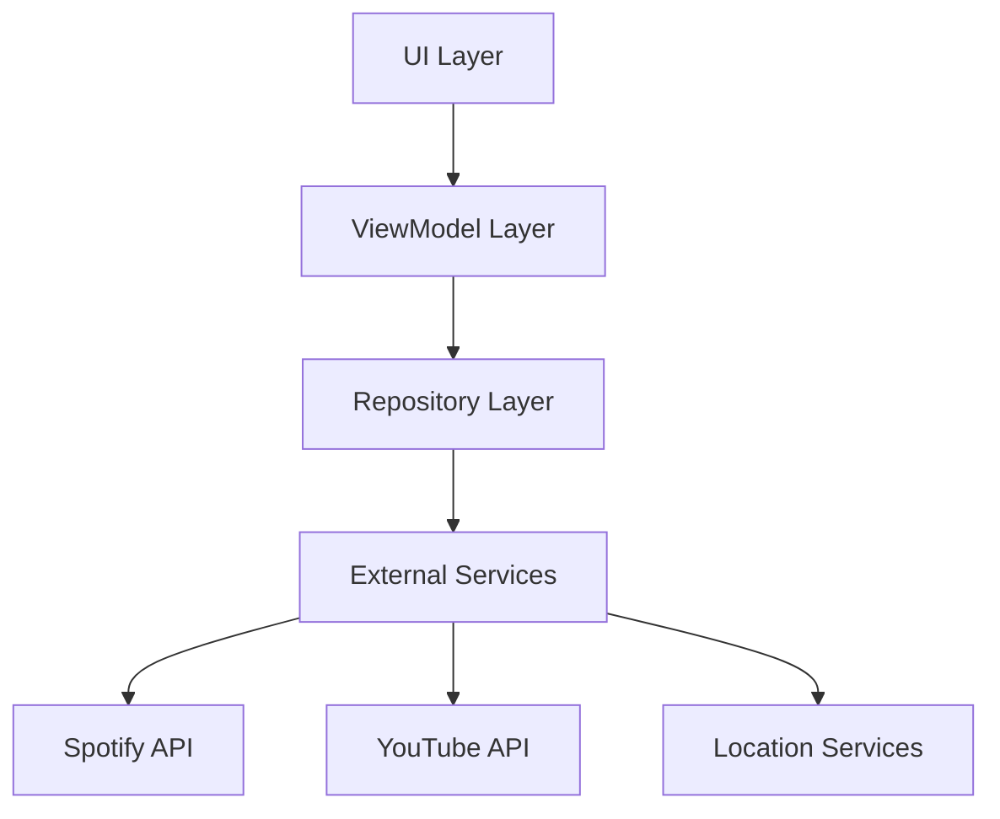
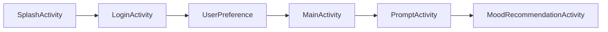
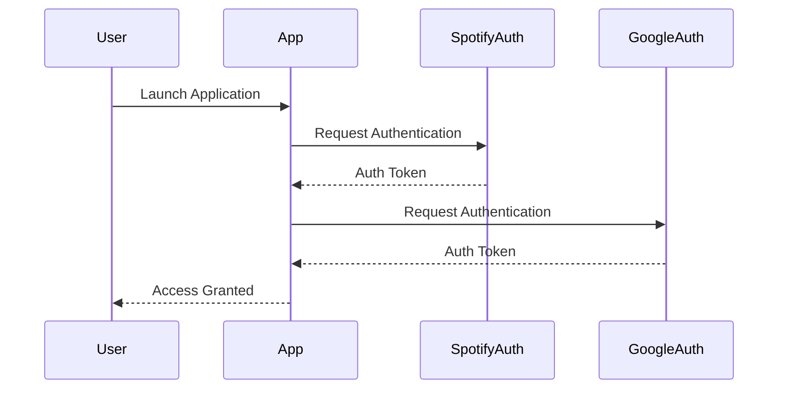

# Software Design Specification
## Cheerly - A Mood-Based Content Recommendation App
Version 2.0  
Last Updated: December 8, 2024

## Table of Contents
1. [Architecture Overview](#1-architecture-overview)
2. [System Components](#2-system-components)
3. [Data Flow & Integration](#3-data-flow--integration)
4. [Module Details](#4-module-details)
5. [Security Implementation](#5-security-implementation)
6. [Performance Optimizations](#6-performance-optimizations)

## 1. Architecture Overview

### 1.1 High-Level Architecture
The application follows a clean MVVM architecture with clear separation of concerns:



### 1.2 Core Design Patterns

#### MVVM Implementation
The application strictly follows MVVM pattern with ViewModels managing UI state and business logic:

```kotlin
class SubscriptionViewModel : ViewModel() {
    private val _subscriptionState = MutableLiveData<SubscriptionState>()
    val subscriptionState: LiveData<SubscriptionState> = _subscriptionState

    fun processSubscription(context: Context) {
        viewModelScope.launch {
            try {
                _subscriptionState.value = SubscriptionState.Loading
                // Subscription processing logic
                _subscriptionState.value = SubscriptionState.Success
            } catch (e: Exception) {
                _subscriptionState.value = SubscriptionState.Error(e.message ?: "Unknown error")
            }
        }
    }
}
```

#### Repository Pattern
Each data source has a dedicated repository implementing single responsibility principle:

```kotlin
class ActivityRepository private constructor() {
    private val TAG = "ActivityRepository"
    private val weatherService: OpenWeatherService
    private val foursquareService: FoursquareService
    private val ticketmasterService: TicketmasterService

    suspend fun getActivityRecommendations(
        mood: String,
        location: ActivityLocation,
        accuracy: Float
    ): List<NearbyActivity> {
        // Implementation details
    }

    companion object {
        @Volatile
        private var instance: ActivityRepository? = null
        
        fun getInstance(): ActivityRepository {
            return instance ?: synchronized(this) {
                instance ?: ActivityRepository().also { instance = it }
            }
        }
    }
}
```

## 2. System Components

### 2.1 Activity Flow


### 2.2 Core Components

#### Activities
- SplashActivity: Entry point and authentication check
- LoginActivity: Service authentication (Spotify, YouTube)
- UserPreference: Initial setup and preferences
- MainActivity: Primary navigation handler
- PromptActivity: Mood input and selection
- MoodRecommendationActivity: Content display and management

#### Fragments
- MoodsFragment: Mood selection interface
- PromptFragment: Alternative mood input
- VideosFragment: YouTube content display
- MusicFragment: Spotify content display
- PodcastsFragment: Podcast recommendations
- ActivitiesFragment: Local activity suggestions

## 3. Data Flow & Integration

### 3.1 Authentication Flow


### 3.2 Content Integration
The application integrates multiple content providers:

- Spotify Integration:
```kotlin
interface SpotifyApiService {
    @GET("recommendations")
    suspend fun getRecommendations(
        @Header("Authorization") auth: String,
        @Query("seed_tracks") seedTracks: String?,
        @Query("seed_genres") seedGenres: String,
        @Query("target_valence") targetValence: Float,
        @Query("target_energy") targetEnergy: Float
    ): Response<SpotifyRecommendationsResponse>
}
```

- YouTube Integration:
```kotlin
interface YouTubeApi {
    @GET("youtube/v3/search")
    suspend fun searchVideos(
        @Query("part") part: String = "snippet",
        @Query("maxResults") maxResults: Int,
        @Query("q") query: String,
        @Query("type") type: String = "video",
        @Query("key") apiKey: String
    ): Response<YouTubeSearchResponse>
}
```

## 4. Module Details

### 4.1 Authentication Module
Handles service authentication and token management:

```kotlin
class SpotifyAuthManager(private val context: Context) {
    companion object {
        private const val CLIENT_ID = "..."
        private const val REDIRECT_URI = "cheerly://callback"
        private const val AUTH_ENDPOINT = "https://accounts.spotify.com/authorize"
        private const val TOKEN_ENDPOINT = "https://accounts.spotify.com/api/token"
    }

    fun startAuth() {
        // Authentication implementation
    }

    suspend fun handleAuthResponse(response: AuthorizationResponse): TokenResponse
}
```

### 4.2 Content Recommendation Module
Implements mood-based content filtering and recommendations:

```kotlin
data class MoodParameters(
    val foursquareCategories: List<Int>,
    val venueKeywords: List<String>,
    val eventCategories: List<String>,
    val eventKeywords: List<String>,
    val maxDistance: Double,
    val preferIndoor: Boolean,
    val preferPopular: Boolean,
    val weatherSensitive: Boolean,
    val timeOfDayPreference: List<String>,
    val pricePreference: PricePreference,
    val moodSpecificFilters: (FoursquareVenue) -> Boolean
)
```

### 4.3 Location Services Module
Manages location-based activity recommendations:

```kotlin
class ActivitiesFragment : Fragment() {
    private lateinit var fusedLocationClient: FusedLocationProviderClient

    private fun loadActivities() {
        viewLifecycleOwner.lifecycleScope.launch {
            val location = withContext(Dispatchers.IO) {
                fusedLocationClient.lastLocation.await()
            }
            // Activity loading implementation
        }
    }
}
```

## 5. Security Implementation

### 5.1 Authentication Security
- OAuth 2.0 implementation for Spotify
- Google Sign-In for YouTube
- Secure token storage using SharedPreferences

### 5.2 Data Protection
```kotlin
class PremiumManager(context: Context) {
    private val sharedPreferences: SharedPreferences =
        context.getSharedPreferences("PremiumPrefs", Context.MODE_PRIVATE)

    fun isPremiumUser(): Boolean {
        return sharedPreferences.getBoolean("isPremium", false)
    }
}
```

## 6. Performance Optimizations

### 6.1 Content Caching
Implementation of efficient caching strategies:

```kotlin
class VideoAdapter(private val videos: List<Video>) :
    RecyclerView.Adapter<VideoAdapter.VideoViewHolder>() {
    // Image caching with Coil
    holder.thumbnailImage.load(video.thumbnailUrl) {
        crossfade(true)
        placeholder(R.drawable.placeholder_image)
        error(R.drawable.error_image)
    }
}
```

### 6.2 Network Optimization
Efficient API handling with Retrofit and coroutines:

```kotlin
class VideoRepository private constructor() {
    suspend fun getVideoRecommendations(mood: String): List<Video> = withContext(Dispatchers.IO) {
        try {
            // Network call implementation
        } catch (e: Exception) {
            Log.e(TAG, "Error getting video recommendations", e)
            emptyList()
        }
    }
}
```

---

## Revision History

| Version | Date | Changes | Author |
|---------|------|---------|---------|
| 1.0 | 2024-10-01 | Initial design | Rajkumar |
| 1.1 | 2024-10-15 | Added premium features | Rajkumar |
| 1.2 | 2024-11-01 | Updated API integration | Rajkumar |
| 2.0 | 2024-12-08 | Final implementation details | Rajkumar |