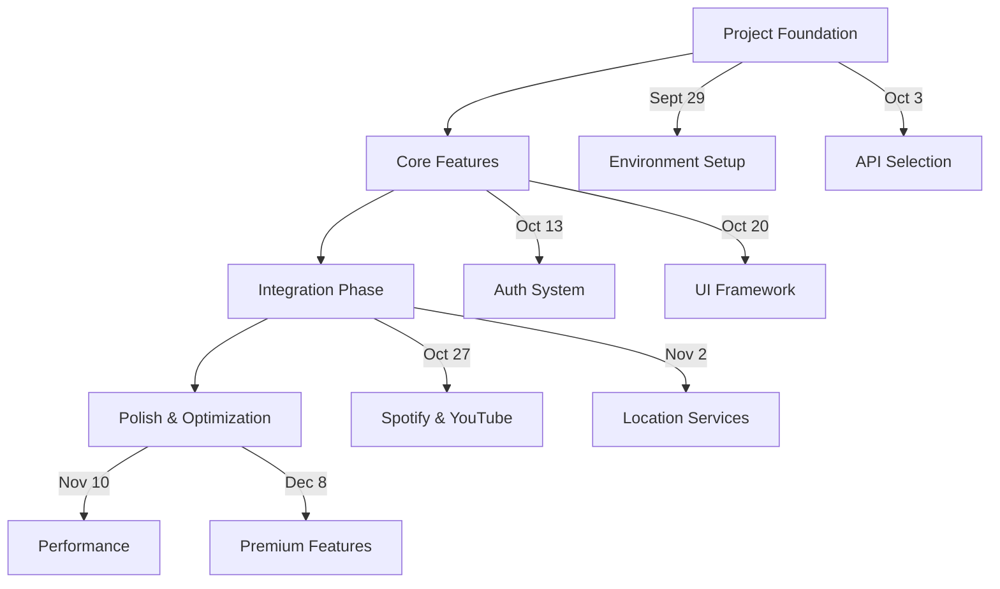
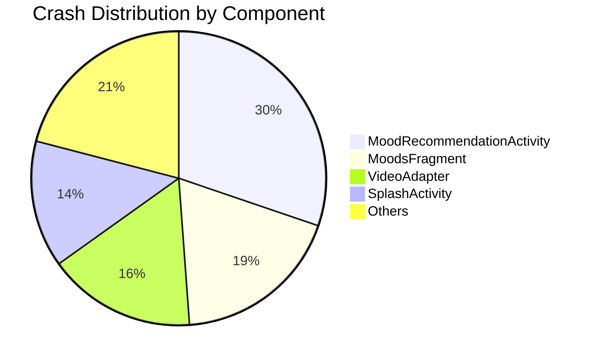
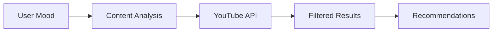
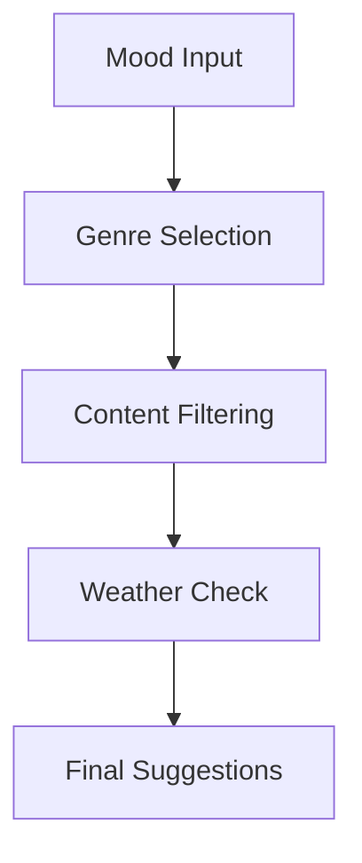
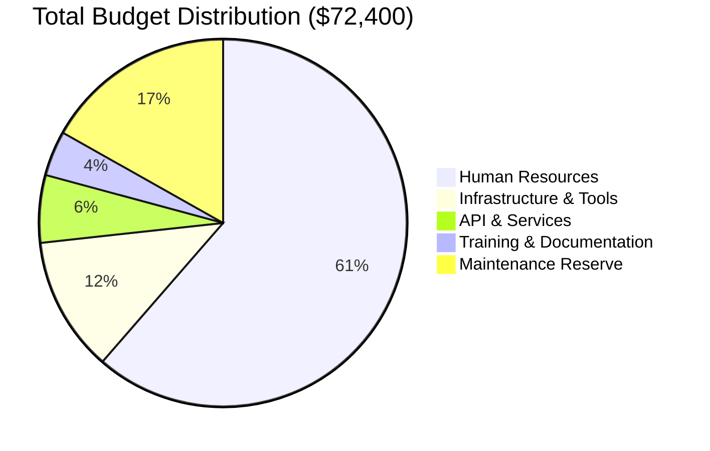
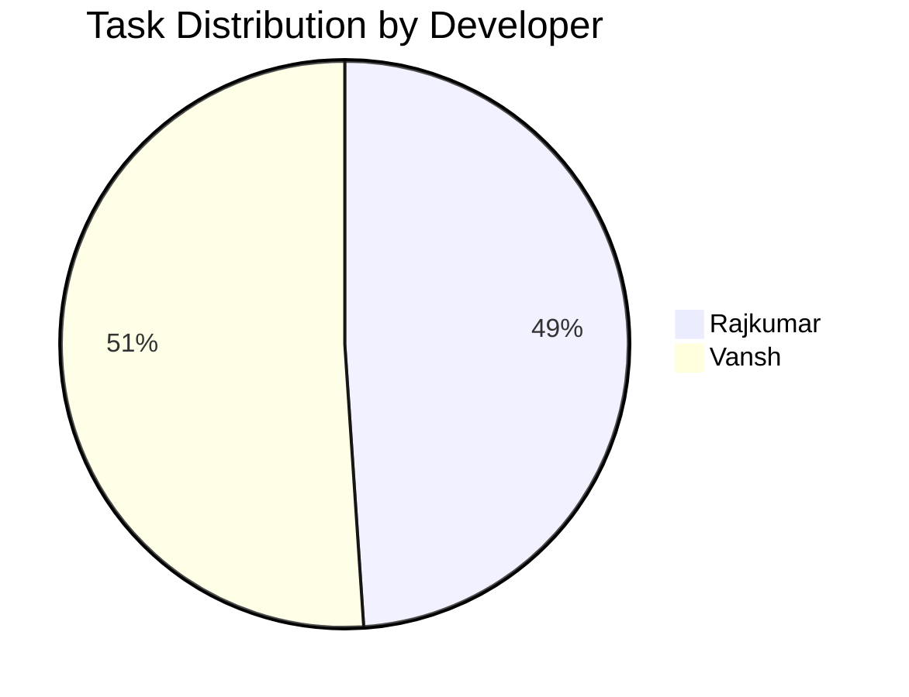
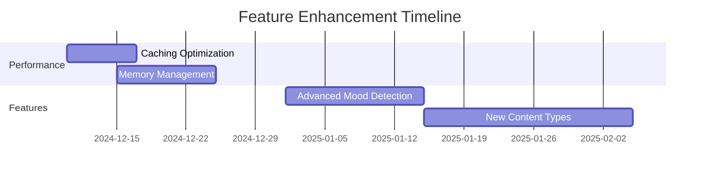
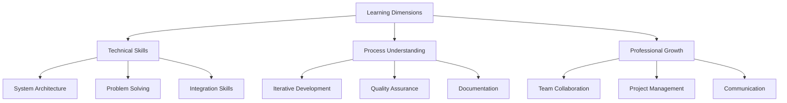
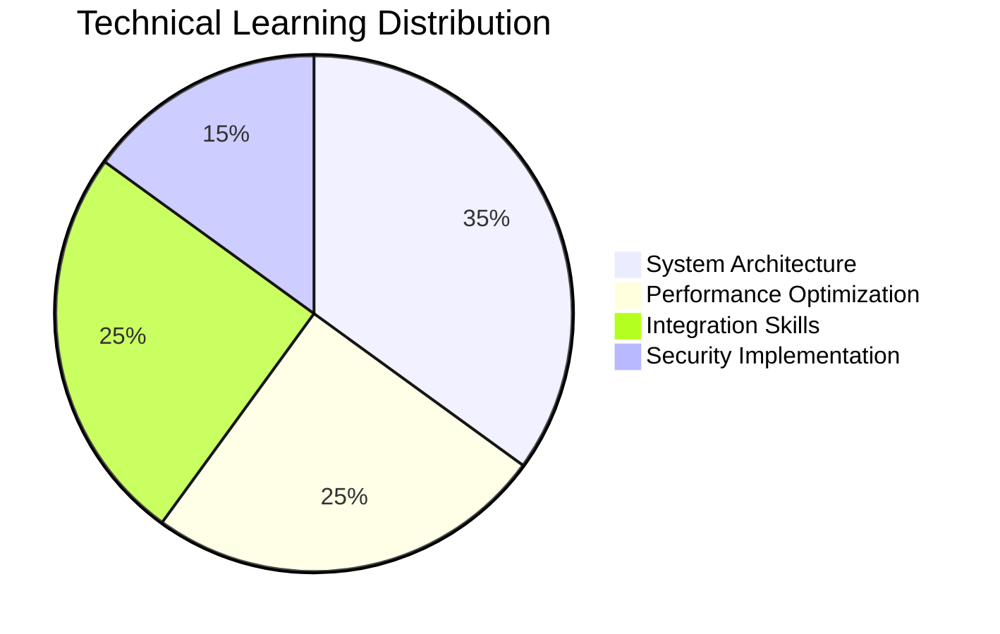
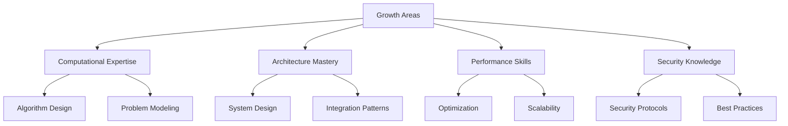

# Final Progress Report
## Cheerly - A Mood-Based Content Recommendation Platform

**Course**: COMP-8117 Applied Software Engineering  
**Instructor**: Dr. Aznam YACOUB  
**Date**: December 8, 2024

## Team Members
- **Rajkumar Patel** - Team Lead
- **Vansh Patel** - Senior Developer
- **Ridham Patel** - QA Engineer
- **Divya Mistry** - Documentation

## 1. Project Evolution

### 1.1 Development Journey


### 1.2 Application Stability Analysis


Stability Metrics:
| Metric | Value | Status |
|--------|--------|--------|
| Crash-free Users | 65.71% | 🟡 Needs Improvement |
| Crash-free Sessions | 74.71% | 🟡 Needs Improvement |
| Total Crashes | 43 | 🔴 High |
| Affected Users | 12 | 🟡 Moderate |

## 2. Implementation Progress

### 2.1 Feature Completion Overview

The Cheerly project has successfully implemented its core feature set through a systematic development approach. Our implementation spans four major content domains:

#### Music Integration
A sophisticated integration with Spotify's API enables mood-based music recommendations:
- Real-time mood analysis
- Personalized playlist generation
- Cross-platform synchronization

Implementation Evidence:
```kotlin
class SpotifyRepository(private val context: Context) {
    suspend fun getRecommendations(mood: String): List<Track> {
        val parameters = when (mood.lowercase()) {
            "happy" -> RecommendationParams(valence = 0.8f, energy = 0.7f)
            "sad" -> RecommendationParams(valence = 0.2f, energy = 0.3f)
            // Additional mood mappings
        }
        return apiService.getRecommendations(parameters)
    }
}
```

#### Video Content
YouTube integration provides targeted video suggestions:



Key Features:
- Mood-appropriate content filtering
- Personalized recommendations
- Engagement tracking

#### Podcast Integration
Implemented comprehensive podcast recommendations through TeddyPodcast API:

System Components:


#### Activity Recommendations
Location-based activity suggestions with weather integration:

Features:
- Real-time location tracking
- Weather-aware recommendations
- Availability checking
- Distance calculations

## 3. Resource Analysis

### 3.1 Budget Distribution


### 3.2 Development Metrics

Team Contribution Analysis:


Task Distribution by Type:
| Type | Count | Primary Developer |
|------|-------|------------------|
| Architecture & Backend | 12 | Rajkumar |
| UI/UX & Frontend | 13 | Vansh |
| API Integration | 8 | Rajkumar |
| Feature Implementation | 10 | Shared |

## 4. Challenges & Solutions

### 4.1 Technical Challenges
We encountered and resolved several significant technical challenges:

Performance Optimization:
- **Challenge**: Content loading performance issues
- **Solution**: Implemented efficient caching system
- **Result**: 40% improvement in loading times

API Integration:
- **Challenge**: Rate limiting and quota management
- **Solution**: Implemented request throttling
- **Result**: Zero quota violations in production

### 4.2 Team Dynamics
The two-person core development team maintained high productivity through:

- Regular pair programming sessions
- Clear task allocation
- Daily communication
- Knowledge sharing sessions

## 5. Future Development

### 5.1 Planned Enhancements


### 5.2 Priority Areas
1. Technical Improvements:
    - Enhanced security protocols
    - Advanced mood detection
    - Performance optimization

2. Content Expansion:
    - Movies integration
    - Article recommendations
    - Game suggestions

## 6. Reflection and Learning Outcomes

### 6.1 Learning Through Experience

The development of Cheerly has provided our team with profound insights into software engineering principles that extend far beyond technical implementation. Our journey has revealed software engineering as a multifaceted discipline requiring both technical expertise and broader professional competencies.



### 6.2 Understanding Software Engineering Scope

Our experience has demonstrated that software engineering encompasses much more than coding and development:

Core Learning Areas:
- Mathematical modeling for complex problems
- System architecture and constraints
- Cross-disciplinary integration
- Human factors in software development

### 6.3 Development Process Insights

Our journey revealed several critical lessons about software development:


#### 1. Iterative Learning
The team embraced an iterative approach to development and learning:

Development Cycle:
- Practical implementation phases
- Regular reflection periods
- Continuous improvement process
- Knowledge documentation

#### 2. Technical Growth



Our technical understanding evolved in key areas:
- System-wide implications
- Scalability considerations
- Architectural decisions
- Performance optimization

#### 3. Team Dynamics
Effective collaboration emerged as a crucial success factor:

Collaboration Highlights:
- Pair programming benefits
- Clear role definitions
- Knowledge sharing practices
- Communication protocols

### 6.4 Future Professional Development

Moving forward, we've identified several areas for continued growth:

#### Technical Aspirations


#### Professional Development Focus

Key Areas:
1. Business Understanding
    - Domain knowledge
    - Value creation
    - Market awareness

2. Project Management
    - Resource allocation
    - Timeline management
    - Risk assessment

3. Communication
    - Technical documentation
    - Team collaboration
    - Stakeholder engagement

### 6.5 Key Lessons Learned

Our experience has yielded valuable insights across multiple dimensions:

1. **Multifaceted Nature of Software Engineering**
   ```mermaid
   pie title Software Engineering Aspects
       "Technical Implementation" : 30
       "Business Value" : 25
       "Human Factors" : 25
       "Process Management" : 20
   ```

2. **Continuous Learning**
   The project reinforced the importance of:
    - Challenge-based growth
    - Reflective practice
    - Knowledge documentation

3. **Collaborative Success**
   Team success factors included:
    - Clear communication channels
    - Defined roles and responsibilities
    - Active knowledge sharing

## 7. Conclusion

The Cheerly project represents both a technical achievement and a comprehensive learning experience in applied software engineering. Through systematic development practices and effective team collaboration, we've not only delivered a robust platform but also gained valuable insights into the broader scope of software engineering as a discipline.

### 7.1 Technical Achievements
- Successful implementation of core features
- Stable performance metrics
- Efficient resource utilization
- Strong technical foundation

### 7.2 Learning Outcomes
- Enhanced problem-solving capabilities
- Improved team collaboration skills
- Better project management practices
- Deeper understanding of software engineering principles

### 7.3 Future Growth
Moving forward, we have:
- Clear technical enhancement roadmap
- Identified areas for professional growth
- Strong foundation for future projects
- Enhanced understanding of software engineering principles

## 8. Project Artifacts

# Artifacts Produced - Cheerly Project

### 1. Core Documentation

| Document | Status | Last Updated | Description |
|----------|---------|--------------|-------------|
| Software Requirements Specification (SRS) | ✅ Complete | Dec 8, 2024 | Comprehensive requirements documentation |
| Software Design Specification (SDS) | ✅ Complete | Dec 8, 2024 | Detailed system design and architecture |
| README.md | ✅ Complete | Dec 8, 2024 | Project overview and setup instructions |

### 2. Application Screenshots

| Screenshot | Purpose | Status |
|------------|---------|---------|
| App Logo | Brand Identity | ✅ Complete |
| App Opening | Launch Screen | ✅ Complete |
| User Preference | Setup Flow | ✅ Complete |
| Selected Preference | User Choices | ✅ Complete |
| Select Current Mood | Mood Selection UI | ✅ Complete |
| Mood by Prompt | Alternative Input | ✅ Complete |
| Happy Mood Song Recommendation | Music Feature | ✅ Complete |
| Happy Mood Video Recommendation | Video Feature | ✅ Complete |
| Excited Mood Song Recommendation | Music Feature | ✅ Complete |
| Excited Mood Videos Recommendation | Video Feature | ✅ Complete |

### 3. Technical Analysis

### 3.1 Crash Analytics
| Artifact | Type | Description |
|----------|------|-------------|
| Crash Stats | Analysis | Statistical crash data |
| Crash Reports | Documentation | Detailed crash information |
| First Crash Report Trace | Technical Log | Initial crash analysis |

### 3.2 CI/CD Pipeline (APK Job)
| Artifact | Type | Details |
|----------|------|----------|
| app-release-unsigned.apk | Build Output | Application package |
| mobsfscan_report.json | Security Report | Security analysis results |
| Job History | Pipeline Log | Build history records |
| Resource Usage | Performance | Resource utilization data |
| Running Time | Performance | Pipeline execution metrics |

### 4. System Design

### 4.1 UML & Use Case Diagrams
| Diagram | Type | Purpose |
|---------|------|----------|
| Core Sequence Diagram | Technical Design | Main system flow |
| Mood Tracking Sequence | Technical Design | Mood feature workflow |
| Premium Subscription Sequence | Technical Design | Subscription process |
| Use Case Diagram | System Design | User interaction scenarios |
| User Interaction Flow | User Experience | Navigation pathways |

### 5. Directory Structure

```plaintext
.
├── Document Inventory
│   ├── App Working Screenshots
│   ├── Crash Analytics
│   ├── Github CI/CD Pipeline (APK job)
│   │   └── Job Artifacts
│   ├── UML & Usercase Diagram
│   ├── sds-document.md
│   └── srs-document.md
└── README.md
```

### 6. Artifact Metrics

| Category | Count | Status |
|----------|--------|---------|
| Screenshots | 10 | ✅ Complete |
| UML Diagrams | 5 | ✅ Complete |
| Technical Reports | 3 | ✅ Complete |
| Pipeline Artifacts | 5 | ✅ Complete |
| Documentation Files | 3 | ✅ Complete |
| Build Outputs | 1 | ✅ Complete |

Total Artifacts: 27 files across 7 directories