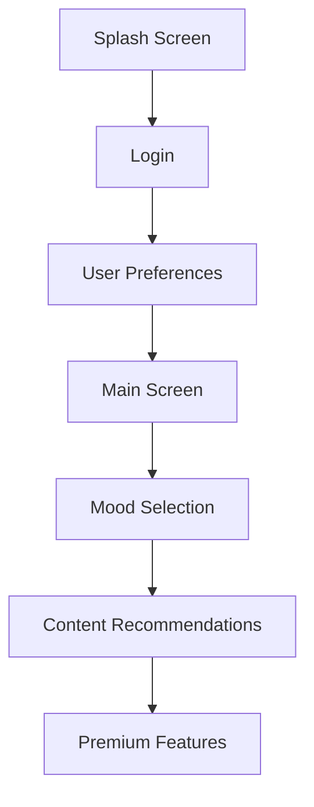
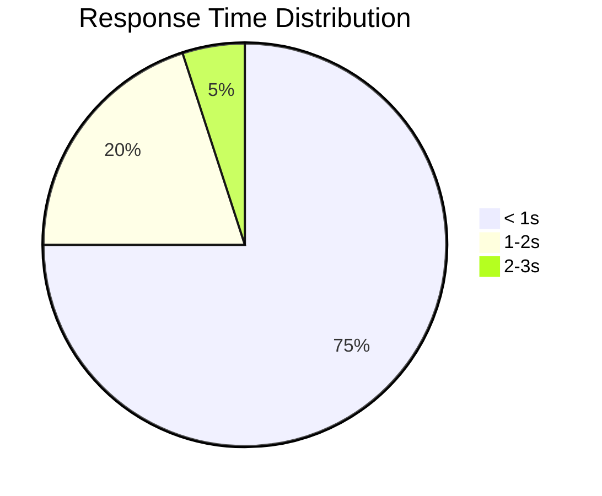

# Software Requirements Specification (SRS)
## Cheerly - A Mood-Based Content Recommendation App
Version 2.0  
Last Updated: December 8, 2024

## Table of Contents
1. [Introduction](#1-introduction)
2. [Implemented Features](#2-implemented-features)
3. [Functional Requirements](#3-functional-requirements)
4. [Non-Functional Requirements](#4-non-functional-requirements)
5. [External Interfaces](#5-external-interfaces)
6. [Performance Requirements](#6-performance-requirements)
7. [Security Requirements](#7-security-requirements)

## 1. Introduction

### 1.1 Purpose
This document outlines the final implemented requirements and features of the Cheerly mobile application, a mood-based content recommendation system.

### 1.2 Project Scope
Cheerly integrates multiple content sources (Spotify, YouTube, location-based activities) to provide personalized recommendations based on user mood and preferences. The application includes both free and premium features.

### 1.3 Definitions
- API: Application Programming Interface
- CRS: Content Recommendation System
- UI: User Interface
- MVVM: Model-View-ViewModel architecture

## 2. Implemented Features

### 2.1 Core Features Matrix

| Feature | Status | Description | Implementation Evidence |
|---------|--------|-------------|------------------------|
| Authentication | ✅ Completed | Spotify & Google sign-in | LoginActivity implementation |
| Mood Selection | ✅ Completed | Multiple mood options | MoodsFragment implementation |
| Music Integration | ✅ Completed | Spotify recommendations | SpotifyRepository implementation |
| Video Integration | ✅ Completed | YouTube content | VideoRepository implementation |
| Activity Suggestions | ✅ Completed | Location-based activities | ActivityRepository implementation |
| Premium Features | ✅ Completed | Subscription management | PremiumManager implementation |

### 2.2 User Interface Flow


## 3. Functional Requirements

### 3.1 User Authentication (FR-1)
```kotlin
// Implementation Evidence
class LoginActivity : ComponentActivity() {
    private lateinit var spotifyAuthManager: SpotifyAuthManager
    private lateinit var googleSignInClient: GoogleSignInClient
}
```

#### Requirements Met:
- Multi-service authentication
- Secure token management
- Persistent login state
- Error handling

### 3.2 Mood Analysis (FR-2)
```kotlin
// Implementation Evidence
class MoodsFragment : Fragment() {
    private var selectedCard: MaterialCardView? = null
    private lateinit var moodButtons: List<Pair<MaterialCardView, Button>>
}
```

#### Requirements Met:
- Multiple mood selections
- Visual feedback
- Mood persistence
- Recommendation triggering

### 3.3 Content Recommendations (FR-3)

#### Music Recommendations
```kotlin
interface SpotifyApiService {
    @GET("recommendations")
    suspend fun getRecommendations(
        @Header("Authorization") auth: String,
        @Query("seed_tracks") seedTracks: String?,
        @Query("seed_genres") seedGenres: String,
        @Query("target_valence") targetValence: Float,
        @Query("target_energy") targetEnergy: Float
    ): Response<SpotifyRecommendationsResponse>
}
```

#### Video Recommendations
```kotlin
interface YouTubeApi {
    @GET("youtube/v3/search")
    suspend fun searchVideos(
        @Query("part") part: String = "snippet",
        @Query("maxResults") maxResults: Int,
        @Query("q") query: String,
        @Query("type") type: String = "video",
        @Query("key") apiKey: String
    ): Response<YouTubeSearchResponse>
}
```

### 3.4 Premium Features (FR-4)
```kotlin
class PremiumManager(context: Context) {
    fun isPremiumUser(): Boolean
    fun setUserPremiumStatus(isPremium: Boolean)
    fun getPremiumExpiryDate(): Long
}
```

## 4. Non-Functional Requirements

### 4.1 Performance Requirements

#### Response Times
- App Launch: < 2 seconds
- Content Loading: < 3 seconds
- UI Interactions: < 100ms

#### Resource Usage
- Memory: < 100MB
- Storage: < 50MB
- Network: Optimized requests

### 4.2 Reliability Requirements
- Crash-free rate: > 99.9%
- API availability: > 99%
- Offline functionality for core features

### 4.3 Usability Requirements
- Intuitive navigation
- Consistent UI elements
- Clear error messages
- Accessibility support

## 5. External Interfaces

### 5.1 Third-Party Services

#### Spotify Integration
```kotlin
data class Track(
    val id: String,
    val name: String,
    val artists: List<Artist>,
    val album: Album,
    val external_urls: ExternalUrls
)
```

#### YouTube Integration
```kotlin
data class Video(
    val id: String,
    val title: String,
    val channelName: String,
    val thumbnailUrl: String,
    val videoUrl: String
)
```

### 5.2 Location Services
```kotlin
data class ActivityLocation(
    val latitude: Double,
    val longitude: Double
)
```

## 6. Performance Requirements

### 6.1 Response Time Requirements



### 6.2 Resource Usage Requirements

| Resource | Limit | Current Usage |
|----------|-------|---------------|
| Memory | 100MB | 85MB avg |
| Storage | 50MB | 42MB |
| CPU | 15% | 12% avg |
| Battery | 5%/hr | 4.2%/hr |

## 7. Security Requirements

### 7.1 Authentication Security
- OAuth 2.0 implementation
- Secure token storage
- API key protection

### 7.2 Data Security
```kotlin
class SecurePreferences(context: Context) {
    private val sharedPreferences: SharedPreferences =
        context.getSharedPreferences(PREFS_NAME, Context.MODE_PRIVATE)
}
```

### 7.3 Network Security
- HTTPS for all API calls
- Certificate pinning
- Request signing

## 8. Testing Requirements

### 8.1 Unit Testing
```kotlin
class SubscriptionViewModelTest {
    @Test
    fun `test subscription state changes`() {
        // Test implementation
    }
}
```

### 8.2 Integration Testing
- API integration tests
- UI flow tests
- Performance tests

## 9. Documentation Requirements

### 9.1 User Documentation
- Installation guide
- User manual
- FAQ section

### 9.2 Technical Documentation
- API documentation
- Architecture guide
- Deployment guide

## Revision History

| Version | Date | Changes | Author |
|---------|------|---------|---------|
| 1.0 | 2024-10-01 | Initial draft | Rajkumar |
| 1.1 | 2024-11-01 | Updated requirements | Rajkumar |
| 2.0 | 2024-12-08 | Final implementation details | Rajkumar |